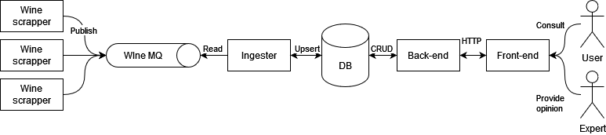

# Wine Energy

The goal of this project is to propose an architecture and a proof of concept for an application that follow these
ideas:

- Develop a research platform that indexes wines available on specialized websites.
  The data (bottle details, prices, and sales sites) can be fetched from an external service, the specifics of which are
  yet to be determined.
- To stand out from the competition, the platform aims to prominently feature domain experts by allowing them to
  integrate their tasting notes.
  The high-value feature would be to provide an evaluation for each bottle, based on the average ratings given by these
  experts.
- Other high-potential features:
    - An alert system where users can save their searches and be notified if a newly identified bottle matches their
      criteria.
    - Access to price histories for each bottle to understand the trends.

## Proposed architecture



The architecture is composed of 2 big parts:

- The first one is the wine bottles data retriever, it composed of:
    - Wine scrappers, developed for each platform selling wine bottles, scrap the websites and extract the data and
      convert it into a common format predefined. Scrapper can be added, updated, remove independently of other
      scrappers, for example at the start of the project, only one scrapper can be created and once the project
      matured, others can be developed and add to the pool of scrappers. Can be developed using different
      programing languages.
    - A message queue for the scrappers to publish the information they retrieve from the websites.
    - An ingester service that subscribe to the queue and insert or update information in the database.
- The second one is the part where the user can interact with the data retrieved:
    - A back-end to access the database and CRUD on the data but also provide notification to the client using the
      front-end.
    - A front-end (or multiple for example mobile application) connected to the back-end, that shows the list of wines
      with additional information such as price, expert opinion.
        - The ability for the expert to provide opinions concerning wines bottle.
        - The ability for the user to create wishlists containing criteria such as price range, expert score range,
          color of the wines, etc. Once a wine newly inserted or updated match these criteria, the user is notified.

## Proof of concept

The proof of concept focus on the backend part with rest API allowing a front end to be plugged in and the ingester
receiving data from mocked wine scrapper using RabbitMQ Queue. It will show how data is integrated into the system and
how user can access it.

### What is done

API endpoints have been created and allow the:

- The basic user can:
    - access the list of wines
    - search from the wines list using criteria
    - register to the website
- The registered user also can:
    - access a specific wine bottle information such as producer, color, current price, expert score, past price.
    - create wishlist with criteria
- The wine expert also can:
    - provide opinion about a wine bottle based on a score out of 100 and a written commentary.

From the Ingestion part:

- The mocked wine scrapper is able to receive a wine information bottle through API endpoint and send it to the
  RabbitMQ Queue
- The Ingester is watching the RabbitMQ Queue and insert the wine bottle information into the Database when it receives
  one.

### Limits and Improvements

- Not all the backend code is covered with Unit and Integration testing but it could be done.

### Future development and needs

As the central link is operational, the focus should be put on the two other endpoints

- The front end should be developed after hiring a front-end or fullstack developer. (if fullstack, the developer
  would be able to maintain the backend rest API part as well as continue developing the front end)
- The first backend developer that work on the project could continue to work on it, especially starting to create
  wines scrappers and maintaining the backend rest API part if there is only another front end developer.
- A devops could also work in the beginning to integrate CI/CD and best practice for the code base (Code quality,etc).
- As the project grows other developer could join the project, for example to create a mobile applications of the
  front-end, or to create and maintain even more wine scrappers.

### Start locally

To start locally each microservice independantly, first you need to have Java 17 and the Docker Engine.

```shell
cd backend
./gradlew bootRun
```

This command will start the application and the containers need for the application, either Postgres, RabbitMQ or both.

### Deploy in production

When pull request is validated, a GitHub actions is triggered to start the build of the Docker for the back-end
microservice. Then the docker is pushed to Docker Hub and a trigger will launch the restart of the Docker on
the production server.

## Sources

Here is the list of website I used to help build this backend (not exhaustive):

- [Spring](https://spring.io/)
- [Baeldung](https://www.baeldung.com)
- [Stackoverflow](https://stackoverflow.com)
- [Docker Hub](https://hub.docker.com)
- [Github](https://github.com)